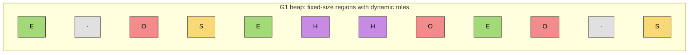
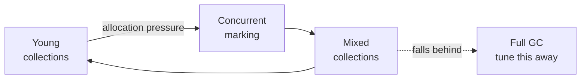

# G1GC (Garbage-First)

The collector designed for **predictable pause times on multi-GB heaps**. G1
gives up some throughput to make sure no single GC event stops the app for
long.

!!! info "Default since Java 9"
    G1 was **introduced experimentally in Java 7** (2011), became
    **production-ready in Java 8u40** (2015), and was **promoted to the
    default collector in Java 9** via [JEP 248](https://openjdk.org/jeps/248).
    Set `-XX:+UseG1GC` explicitly if you want to be unambiguous, even though
    it's the default.

## How it works

G1 breaks the heap into **equal-sized regions** (typically 1 – 32 MB each). A
region is *not* permanently young or old — its role changes over time. At any
moment, some regions hold Eden, some hold Survivor, some hold Old, and some
hold **Humongous** objects (a single object ≥ half a region).

Two collection modes:

- **Young collection** — evacuate live objects out of Eden / Survivor regions
  into new Survivor / Old regions. Stop-the-world, but bounded by the
  pause-time target.
- **Mixed collection** — evacuate young regions *plus* a subset of the
  "garbage-first" old regions (those with the most reclaimable space). This
  is the trick: G1 collects the old gen incrementally, in slices, instead of
  one huge full-GC compaction.

A **concurrent marking cycle** runs in the background to identify which old
regions are worth collecting, so mixed collections know where to look.

If G1 falls behind — allocation outpaces collection — it triggers a **full
GC** as a safety net. A full GC in G1 is a red flag: it means the collector
couldn't keep up and you need to tune.

## Heap layout

Legend: **E**den · **S**urvivor · **O**ld · **H**umongous · **·** free.
Regions are the same size, but their roles are assigned dynamically.

## When to use it

- Web services and APIs with p99 / p999 SLAs.
- Heaps between ~4 GB and ~32 GB.
- Anywhere a multi-second full GC is unacceptable.

## Fundamental tuning parameters

| Flag | What it controls | Typical use |
|------|------------------|-------------|
| `-XX:+UseG1GC` | Selects the collector. | Default on Java 9+; set explicitly for clarity. |
| `-Xms<size>` / `-Xmx<size>` | Heap bounds. | Set equal on servers. |
| `-XX:MaxGCPauseMillis=<ms>` | Target pause time (soft goal). | Default 200. Lower it (e.g. 100) if pauses matter more than throughput. |
| `-XX:G1HeapRegionSize=<size>` | Region size (1 MB – 32 MB, power of 2). | Auto-sized from heap; override only if you have humongous-object problems. |
| `-XX:InitiatingHeapOccupancyPercent=<n>` | Old-gen % that triggers a concurrent marking cycle. | Default 45. Lower it if you see full GCs — start marking earlier. |
| `-XX:G1NewSizePercent=<n>` | Min young-gen size as % of heap. | Default 5. Raise it if young collections are too frequent. |
| `-XX:G1MaxNewSizePercent=<n>` | Max young-gen size as % of heap. | Default 60. |
| `-XX:G1MixedGCCountTarget=<n>` | Target mixed collections per marking cycle. | Default 8. Raise to spread old-gen work over more, shorter pauses. |
| `-XX:ParallelGCThreads` / `-XX:ConcGCThreads` | STW / concurrent GC worker threads. | Cap in shared containers. |

!!! warning "MaxGCPauseMillis is a *target*, not a guarantee"
    G1 sizes the young gen and picks regions to hit the target — but if the
    workload allocates faster than the collector can keep up, pauses will
    overrun. Treat it as a hint, then verify with GC logs.

!!! tip "Think of it as"
    A fleet of small vans on rotating routes. Any one van is quick and
    unobtrusive; the fleet works incrementally, so no single collection
    stops the whole city.

## Key Takeaways

- G1 prioritises **predictable pause times** over raw throughput.
- **Default since Java 9** (JEP 248); introduced experimentally in Java 7,
  production-ready in Java 8u40.
- The old generation is collected **incrementally** through mixed collections,
  guided by a concurrent marking cycle — no single big compaction.
- A **full GC under G1** is a symptom, not a solution — the collector is
  falling behind. Fix it with a bigger heap, an earlier
  `InitiatingHeapOccupancyPercent`, or by investigating an allocation spike.
- **`-XX:MaxGCPauseMillis`** is a soft target; trust the GC logs, not the
  flag.
