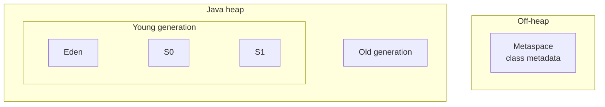
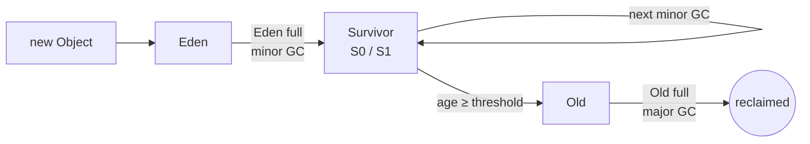

# Garbage Collection

Java's garbage collector reclaims heap memory that objects no longer reach.
You don't call `free()` — the collector finds unreachable objects and
recycles their space.

This section covers the two collectors you meet first in production:

- **[Parallel GC](parallel-gc.md)** — throughput-oriented collector.
- **[G1GC](g1gc.md)** — pause-time-oriented collector.

## Default collector by Java version

| Java version | Default (server-class VM) | Notable |
|--------------|---------------------------|---------|
| Java 5 – Java 8 | Parallel GC | Throughput collector; long full-GC pauses |
| Java 9+ | **G1GC** | JEP 248 promoted G1 to default |
| Java 14 | G1GC | CMS removed (JEP 363) |
| Java 15+ | G1GC | ZGC (JEP 377) and Shenandoah (JEP 379) production-ready |

You can override the default at any time with a flag: `-XX:+UseParallelGC`,
`-XX:+UseG1GC`, `-XX:+UseZGC`, `-XX:+UseShenandoahGC`.

## Heap memory architecture

The heap is where every Java object lives — every `new`, every array, every
lambda-captured object. HotSpot lays it out **generationally**, because most
objects die young: a request creates them, a response is written, and they
become unreachable within milliseconds. A minority survive — long-lived
caches, session data, framework singletons. The heap is split so the
collector can visit the young stuff often and the old stuff rarely.

- **Young generation** — where new objects are allocated. Small and collected
  frequently.
    - **Eden** — the allocation ground. Nearly every `new` lands here.
    - **Survivor spaces (S0, S1)** — two equal-sized "aging" spaces. Live
      objects bounce between them across minor GCs until they're old enough
      to be promoted. Only one is ever in use at a time — the other is empty
      and waiting to receive the next batch of survivors.
- **Old generation** — where objects that survive several young collections
  end up. Larger, and collected less often.
- **Metaspace** (Java 8+) — **off-heap**. Stores class metadata (`Class`
  objects, method info, constant pool). Not part of the Java heap and not
  managed by the GC in the same way, but mentioned here because it's
  commonly confused for a heap region. Replaced the old PermGen (removed in
  Java 8).

## Memory regions during a GC cycle

Objects flow through the heap in a predictable pattern. Each region has a
role in the cycle:

1. **Allocation** — a `new` operation carves space out of **Eden**.
   Extremely cheap (bump-the-pointer — the JVM just advances a pointer to
   the end of the used region).
2. **Minor GC** triggers when Eden fills up. Live objects in Eden **and** the
   "from" Survivor space are copied into the "to" Survivor space. Dead
   objects are simply left behind — the entire region is treated as empty
   afterward. This is called a **copying collector** and is why minor GC is
   fast: work is proportional to *live* data, not total data.
3. **Aging** — each surviving minor GC bumps an object's *age counter*. The
   `-XX:MaxTenuringThreshold` flag (default 15) sets the ceiling.
4. **Promotion** — objects that reach the tenuring threshold, or that no
   longer fit in Survivor, are copied ("promoted") to the **Old generation**.
5. **Major GC** triggers when Old fills up. It reclaims dead objects across
   the old generation (and usually the young generation too, in the same
   pass).

## Minor GC vs. Major GC

|  | Minor GC | Major GC |
|--|----------|----------|
| **Scope** | Young generation only | Old generation (and usually young too) |
| **Trigger** | Eden is full | Old is full, or promotion fails |
| **Frequency** | Often (seconds – minutes) | Rare (minutes – hours) |
| **Duration** | Milliseconds | Can be seconds on large heaps |
| **Algorithm** | Copying — cheap because young is small and mostly dead | Mark-compact or concurrent marking — expensive |
| **Stop-the-world?** | Yes (in Parallel and G1) | Yes, at least partially |

!!! note "\"Major GC\" vs. \"Full GC\""
    Terminology varies. A **full GC** collects the *entire* heap in one
    stop-the-world pass — that's what Parallel GC always does for its
    old-gen work. G1 usually collects the old generation as a series of
    smaller **mixed** collections instead. In G1, a "full GC" only happens
    as a fallback when the collector falls behind, and it's a red flag.

## Key Takeaways

- The **default collector** was **Parallel GC through Java 8** and has been
  **G1GC since Java 9** (JEP 248).
- The heap is split into a **young generation** (Eden + S0/S1) and an
  **old generation**. Class metadata lives **off-heap in Metaspace**.
- Objects normally start in Eden, survive minor GCs by bouncing through the
  survivor spaces, and eventually get **promoted** to Old.
- **Minor GC** cleans the young generation and is cheap and frequent.
  **Major GC** cleans the old generation (and usually the young at the same
  time) and is expensive and rare.
- Collector-specific mechanics and tuning live in
  **[Parallel GC](parallel-gc.md)** and **[G1GC](g1gc.md)**.
