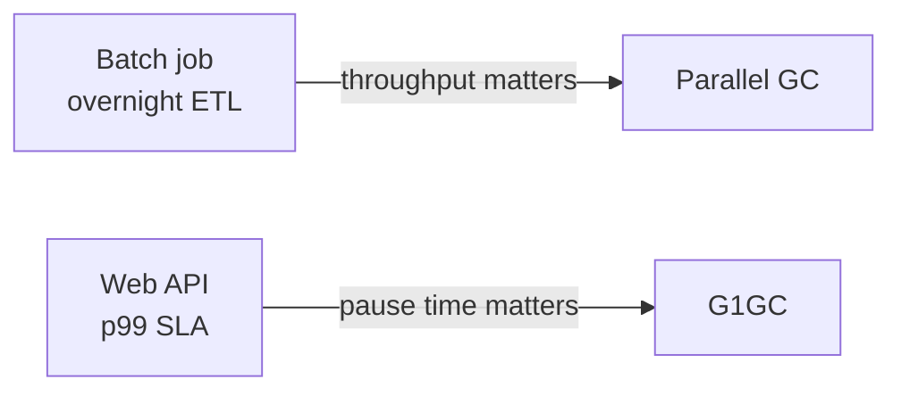

# Garbage Collection

Java's garbage collector reclaims heap memory that objects no longer reach.
You don't call `free()` — the collector finds unreachable objects and recycles
their space. **Which collector runs, and how you tune it, decides whether your
app spends its time serving requests or pausing to clean up.**

This section covers the two collectors you meet first in production:

- **[Parallel GC](parallel-gc.md)** — throughput-oriented. Default on
  server-class JVMs from **Java 5 through Java 8**.
- **[G1GC](g1gc.md)** — pause-time-oriented. Default on server-class JVMs
  from **Java 9 onward** (JEP 248).

The concepts below apply to every HotSpot collector, so the mental model
carries forward when you meet ZGC or Shenandoah later.

## Concepts you need first

### The generational hypothesis

Most objects die young: a request creates them, a response is written, and
they become unreachable within milliseconds. A minority survive — long-lived
caches, session data, framework singletons. The collectors bet on this and
split the heap into generations:

- **Young generation** — where new objects are allocated. Collected often
  and quickly.
- **Old generation** — where objects that survive several young collections
  get promoted. Collected less often; each collection is more expensive.

Young-generation collections are called **minor GCs**; old-region work is
**major GC** (Parallel) or **mixed GC** / **concurrent cycle** (G1).

### Stop-the-world

A GC pause during which every application thread is frozen while the collector
works. Every HotSpot collector does *some* STW work — collectors differ in
how much and for how long.

### Throughput vs. latency

Every collector picks a point on this spectrum:

- **Throughput** — total CPU time spent doing app work vs. GC work. Parallel
  GC optimises for this.
- **Latency** — how long an individual pause lasts. G1GC (and ZGC, Shenandoah)
  optimise for this.

Higher throughput usually means fewer but longer pauses; lower latency means
more frequent but shorter pauses. You can't optimise both on the same workload
— pick the one your users feel.



## A brief history of the default collector

| Java version | Default (server-class VM) | Notable |
|--------------|---------------------------|---------|
| Java 5 – Java 8 | Parallel GC | Throughput collector; long full-GC pauses |
| Java 9+ | **G1GC** | JEP 248 promoted G1 to default |
| Java 14 | G1GC | CMS removed (JEP 363) |
| Java 15+ | G1GC | ZGC (JEP 377) and Shenandoah (JEP 379) production-ready |

## Parallel vs. G1 at a glance

| Dimension | Parallel GC | G1GC |
|-----------|-------------|------|
| Default in | Java 5 – 8 | Java 9+ |
| Optimises for | Throughput | Pause time |
| Heap layout | Contiguous young / old | Fixed-size regions |
| Young collection | STW, parallel | STW, parallel |
| Old collection | Full STW compaction (**slow**) | Incremental mixed collections (**bounded**) |
| Concurrent work | None | Marking runs alongside app threads |
| Good heap size | Small – medium (< 4 GB) | Medium – large (4 – 32 GB) |
| Bad news mode | Long full-GC pause | Fallback full GC (tune to avoid) |

## Observing GC — the one flag you'll always want

Without logs, tuning is guessing. Enable unified logging (Java 9+):

```bash
-Xlog:gc*:file=gc.log:time,uptime,level,tags:filecount=5,filesize=10M
```

Read: log every GC event with timestamps and phase tags, rotate through 5
files of 10 MB each. Any tuning conversation starts with these logs.

## Key Takeaways

- **Parallel GC** favours throughput; **G1GC** favours predictable pause time.
- Java 9 made **G1 the default** — before then, Parallel GC was the standard
  server-side collector.
- **`-Xmx`, `-Xms`, and the collector choice** dominate almost every tuning
  outcome. Fine-grained flags matter only after those are right.
- **`-XX:MaxGCPauseMillis` is a target**, not a promise. Trust the GC logs,
  not the flag.
