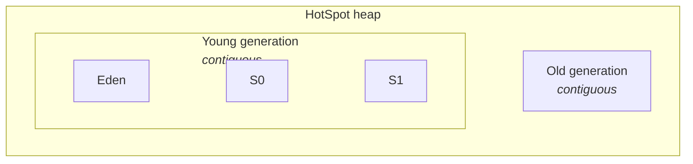

# Parallel GC

The classic **throughput collector**. Simple, aggressive, and effective when
raw work-per-CPU matters more than tail latency.

!!! info "Default in Java 5 – Java 8"
    On server-class JVMs, Parallel GC (a.k.a. the *Throughput Collector*) was
    the default from **Java 5 through Java 8**. From **Java 9 onward, G1GC is
    the default** ([JEP 248](https://openjdk.org/jeps/248)) — on modern JDKs
    you now opt into Parallel explicitly with `-XX:+UseParallelGC`.

## How it works

- **Young collection:** all application threads stop. Multiple GC threads
  (one per core by default) copy live objects from Eden to a Survivor space
  in parallel. Fast, but stop-the-world.
- **Old collection ("Full GC"):** all application threads stop. Multiple GC
  threads compact the entire old generation. This can take **seconds** on a
  multi-GB heap — the main downside.

There is no concurrent phase. The collector's whole strategy is "do lots of
GC work in parallel while the app is paused, then get out of the way."

## Heap layout

Objects are allocated in Eden. Survivors of a minor GC bounce between S0 and
S1, aging each cycle; once old enough (or when Survivor overflows), they are
**promoted** to the old generation. A full GC compacts the old gen in place.

## When to use it

- Batch jobs, data pipelines, offline processing — anywhere throughput
  matters more than tail latency.
- Small heaps (< 4 GB) where a full GC is still fast enough.
- Not for interactive services with tight p99 SLAs.

## Fundamental tuning parameters

| Flag | What it controls | Typical use |
|------|------------------|-------------|
| `-XX:+UseParallelGC` | Selects the collector. | Explicit opt-in on Java 9+. |
| `-Xms<size>` | Initial heap size. | Set equal to `-Xmx` on servers to skip resize pauses. |
| `-Xmx<size>` | Maximum heap size. | The single most impactful flag — start here. |
| `-XX:ParallelGCThreads=<n>` | GC worker thread count. | Defaults to core count. Cap it in shared containers. |
| `-XX:MaxGCPauseMillis=<ms>` | Target pause time (soft goal). | Parallel shrinks young gen to try to hit this — often at the cost of throughput. |
| `-XX:GCTimeRatio=<n>` | Target ratio of app time to GC time as `n:1`. | `19` → aim for ≤ 5 % GC time. |
| `-XX:NewRatio=<n>` | Old-to-young ratio as `n:1`. | `2` → young is 1/3 of the heap. |

!!! tip "Think of it as"
    A big garbage truck that comes on a schedule and blocks the whole street
    while it works. Efficient per bag collected, disruptive to traffic.

## Key Takeaways

- Parallel GC prioritises **throughput** — total useful work per CPU — over
  individual pause length.
- Every collection is stop-the-world; a **full GC** on a large heap can pause
  the app for seconds.
- Was the **default from Java 5 through Java 8**; still a fine choice for
  batch and background workloads on Java 9+ if you set `-XX:+UseParallelGC`.
- Tune `-Xmx` and `-Xms` first; reach for `MaxGCPauseMillis` or
  `GCTimeRatio` only after that.
